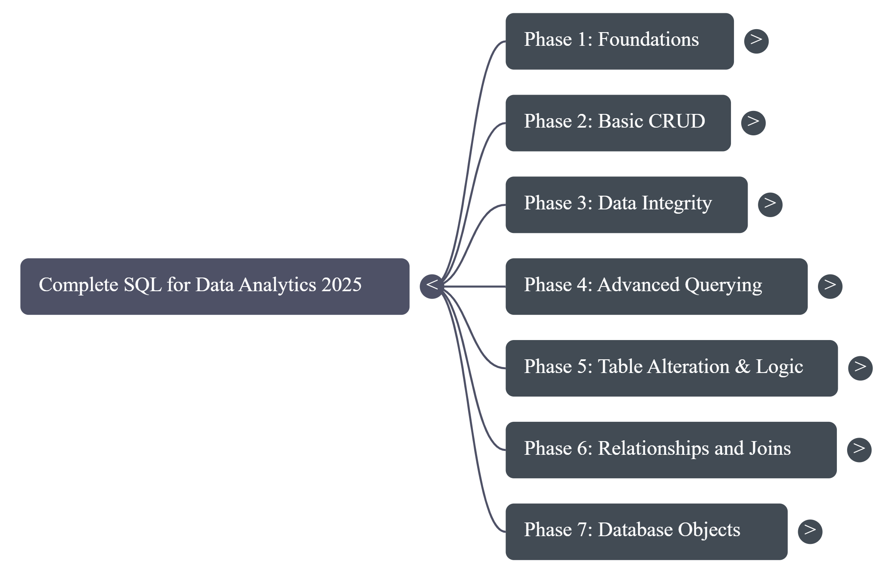

# DAY 88 to 95

*Focus area: **PostgreSQL***

In this period I completed PostgreSQL — the notes, visuals, and resources below capture the key concepts, diagrams and references.

---

## Table of Contents

- [Mind Map](#mind-map) 
- [Infographics](#infographics) 
- [Resources](#resources) 

---

## Mind Map

*A visual overview of the main PostgreSQL concepts and relationships.*

---

## Infographics

*Useful infographics summarizing commands, architecture, and workflows.*

---

## Resources

- [info](pdff.pdf) — local PDF copy

**PDF Drive link:**

[pdf](https://drive.google.com/file/d/14QFlmOVkpIhdbg_Cy4Vmpa_aoA0wt9kE/view?usp=drivesdk)

---

> ## YT Link: [Sherians AI School](https://www.youtube.com/watch?v=p1epCuYb5OQ&t=15325s)

> Notes: All original files (mindmap.png, unnamed.png, and pdff.pdf) and the Google Drive link are preserved above. If you'd like, I can add command snippets, a short quickstart, or embedded previews next.

